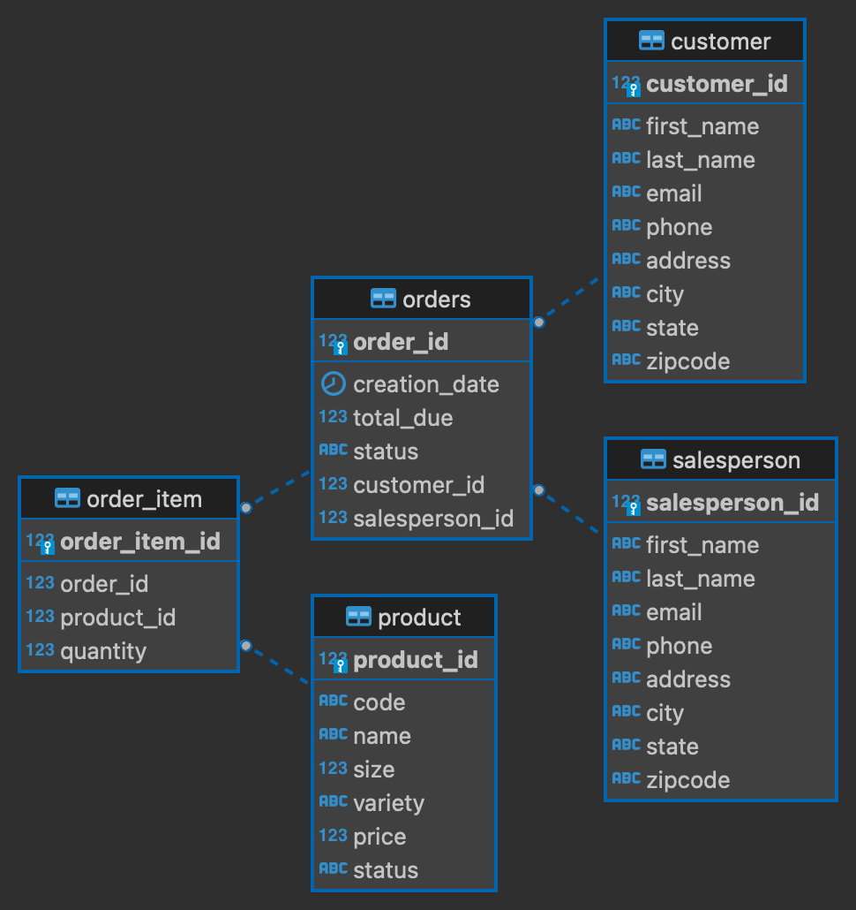

# Introduction
This app is a connection between Java and RDBMS. It uses the CRUD and DAO design patterns. The technologies used for this app are JDBC, Maven, PSQL, GitHub, DBeaver and Java. 
# Implementaiton
## ER Diagram

## Design Patterns
The DAO pattern is the Data Access Object pattern, where it has an interface which defines what operations to be made on the model object such as CRUD. It also has a class that implements those methods and we have the model object to store data retrived from the dao object using getters and setters. Repository focuses on single data access per table. It is more focused on the abstraction of collection of objects and is in a higher level layer than the DAO design pattern.
# Test
To test the app against the database we first start the docker container for postgres, and once thats started we are able to login to the database. Once logged in the database, we can then populate the database with the tables using the sql files. After we can do the CRUD operations using JDBCExecutor.java and check if they work by printing the results of the customer object for a certain id or manually checking the database for results.
