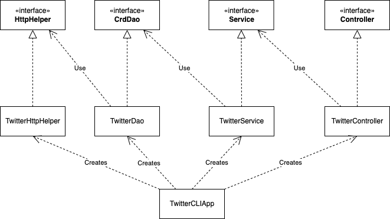

# Introduction
Created an app that can create, update and delete a tweet using the Twitter REST API. This app follows the DAO design pattern and uses Mockito and JUnit to create test cases for testing the app. App uses Maven to install all the dependencies needed to run the application. It is then dockerized for easy deployment.

# Quick Start
- how to package your app using mvn?
  To package the app use
```
mvn clean package
```
- To run your app with docker
```
docker run --rm \
-e consumerKey=YOUR_VALUE \
-e consumerSecret=YOUR_VALUE \
-e accessToken=YOUR_VALUE \
-e tokenSecret=YOUR_VALUE \
jrvs/twitter_app post|show|delete [options]
```

# Design
## UML diagram


# App/Main
This part of the component works on getting the cli arguments and use those arguments to either create, read or delete a tweet

# Controller
This layer consumes user input (args in this app) and calls the corresponding service layer method. It does not handle any business logic.

# Service
The service layer classes handles the business logic of the application. Check if the text reaches a certain limit or lat/lon is in range.

# DAO
DAO layer classes only handle data with external storage, such as databases, and REST APIs.

## Models
Models are implemented with POJOs which is a class with private member variables and public getter and setters. This class encapsulates Tweet data which often display in JSON format.
## Spring
  We use the @bean annotation to define the dependency relationships. Then create an Ioc container which will automatically instantiate all Beans base on the relationship you specified in the previous step. Then used the autowire annotation to implicity inject the dependency.

# Test
Used integration testing to test the classes and their dependencies to make sure they are run properly. Did unit testing using mockito to only test the classes isolated and mock their dependencies.

## Deployment
Created a dockerfile setting the environment needed to run the application. After you package the java application and build the docker image. Then it was pushed to the docker hub where you can pull the image and run the container.

# Improvements
- Work on having an update tweet functionality
- Able to extend find functionality to not just with id
- Being able to give current location rather than manually inputing lon/lan